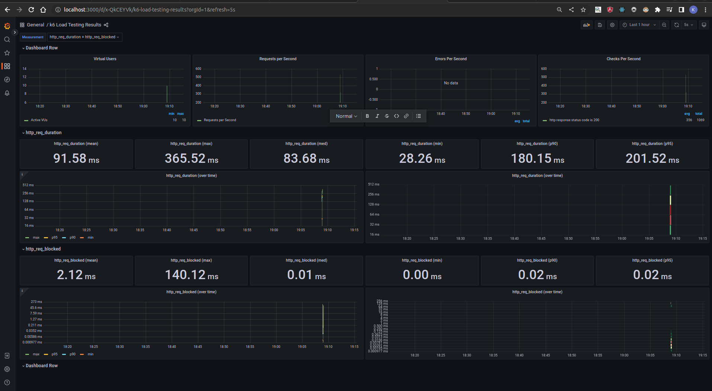
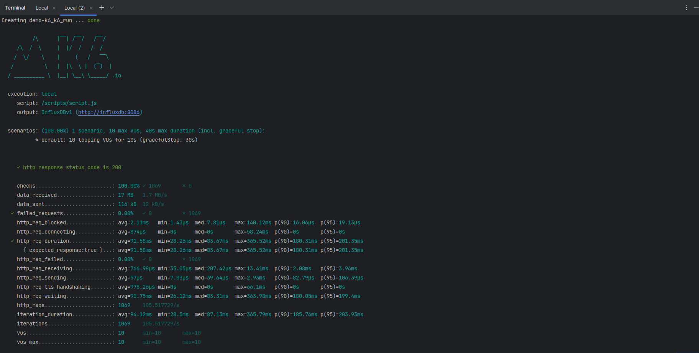

# Demo K6

### Setup

To set up dashboard and database to see tests results, run this command:

```shell
make setup
```
Don't forget to import dashboard with pre-defined id : 2587. 

Source [https://medium.com/@nairgirish100/k6-with-docker-compose-influxdb-grafana-344ded339540](https://medium.com/@nairgirish100/k6-with-docker-compose-influxdb-grafana-344ded339540)

#### Example of dashboard


### Run test

Run the command below to start performance tests

```shell
make run file=scripts.js
```

#### Example of test results

